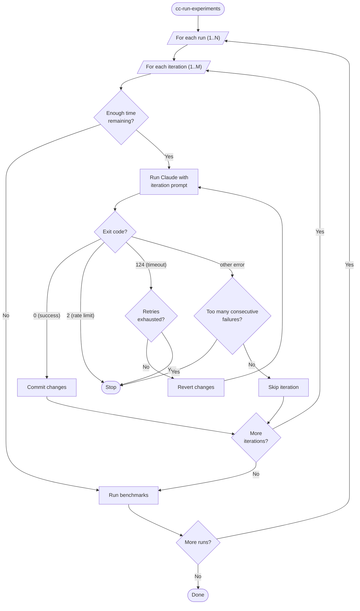

# Performance Analysis Script Usage

## Prerequisites

- [uv](https://docs.astral.sh/uv/) installed
- Python 3.12+
- `claude` CLI available on PATH

## Installation

```bash
cd cc-experiment-runner
uv sync
```

## Quick Start

```bash
# Via the installed console script
cc-run-experiments <directory> <prefix> [baseline-branch]

# Or via uv run
uv run cc-run-experiments <directory> <prefix> [baseline-branch]

# Or as a module
uv run python -m cc_experiment_runner <directory> <prefix> [baseline-branch]
```

**Examples:**

```bash
# Run with plugin enabled (default)
cc-run-experiments ../byopl24-02 2025-01-30--perf main

# Run without plugin
cc-run-experiments --no-plugin ../byopl24-02 2025-01-30--perf main
```

## Parameters

### Positional Arguments

- `directory` - Path to the project directory where Claude and git operations run
- `prefix` - Unique identifier for this analysis run (used in branch names)
- `baseline-branch` - (Optional) Git branch to use as baseline (default: `main`)

### Options

- `--no-plugin` - Run analysis without the plugin (default: with plugin enabled)

## How It Works

1. **Creates isolated branches** for each iteration: `<prefix>-run-<N>-iteration-<M>`
2. **Runs Claude autonomously** with your prompt for multiple iterations
3. **Each iteration** builds upon the previous one's improvements
4. **Commits changes** automatically with descriptive messages
5. **Runs benchmarks** at the end of each run



## Configuration

Default settings in `src/cc_experiment_runner/config.py`:
- **Iterations per run**: 10
- **Total runs**: 5
- **Timeout per run**: 2 hours

## Output

- **Branches**: One per iteration (`<prefix>-run-<N>-iteration-<M>`)
- **Benchmark results**: CSV files in `benchmark-results/`

## Error Handling

- **Rate limit**: Exits immediately
- **2 consecutive failures**: Assumes persistent issue and stops
- **Timeout**: Commits partial changes and moves to next run
- **Single error**: Skips iteration and continues

## Project Structure

```
cc-experiment-runner/
├── pyproject.toml
├── README.md
└── src/
    └── cc_experiment_runner/
        ├── __init__.py
        ├── __main__.py        # python -m entry point
        ├── cli.py             # argument parsing and main orchestration
        ├── config.py          # configuration constants
        ├── git.py             # git helper functions
        ├── process.py         # process termination utilities
        ├── claude.py          # Claude CLI invocation and error detection
        └── benchmarks.py      # benchmark runner
```

## Tips

- Use a descriptive prefix with date: `2025-01-30--feature-name`
- Keep prompt files focused on specific optimization goals
- The script creates many branches - clean up old ones periodically
